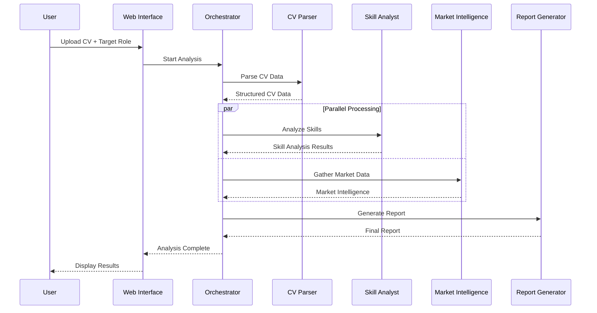
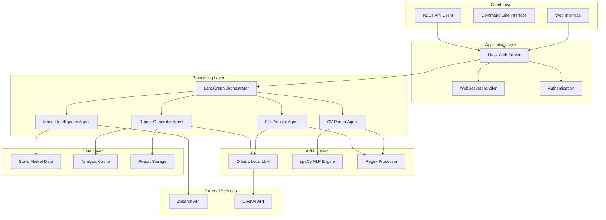

# AI-Powered Skill Gap Analyst

**Multi-Agent System for Automated CV Analysis and Skill Assessment**

A comprehensive solution for HR professionals to automatically analyze CVs, identify skill gaps, and generate actionable insights. Built using LangGraph multi-agent architecture, this system provides detailed candidate assessments in under 30 seconds.

## Video Demo

<div align="center">

## System Demonstration

[](https://www.youtube.com/watch?v=X4c2s7fIF00 "Watch on YouTube")

_Complete walkthrough: CV upload • real-time analysis • report generation_

</div>


## Overview

The AI Skill Gap Analyst is designed to streamline the recruitment process by providing objective, data-driven analysis of candidate qualifications. The system automatically extracts skills, compares them against market requirements, and generates professional reports with actionable recommendations.

### Key Benefits for HR Teams

- **Efficiency**: Process CVs 10x faster than manual review
- **Consistency**: Standardized evaluation criteria across all candidates
- **Insights**: Detailed skill gap analysis with improvement recommendations
- **Scalability**: Handle high-volume recruitment without quality compromise
- **Integration**: Seamless integration with existing HR workflows

## System Architecture

### Multi-Agent Workflow



### 1. CV Parser Agent

**Function**: Converts unstructured CV data into structured information
**Technology**: Advanced NLP with regex pattern matching
**Output**: Standardized candidate profile with contact details, experience, and education

### 2. Skill Analyst Agent

**Function**: Identifies and categorizes technical and soft skills
**Technology**: Rule-based analysis with optional AI enhancement
**Output**: Comprehensive skill inventory with proficiency levels

### 3. Market Intelligence Agent

**Function**: Gathers current job market data and trends
**Technology**: Real-time API integration with static data fallback
**Output**: Market demand analysis, salary benchmarks, and skill trends

### 4. Report Generator Agent

**Function**: Creates professional analysis reports
**Technology**: Template-based generation with AI enhancement options
**Output**: Executive summaries and detailed technical breakdowns

## Configuration Options

The system offers five distinct configuration modes to match different organizational needs:

| Option | AI Model           | Market Data       | Extraction Method | Analysis Mode     | Processing Time | Accuracy | Best For                          |
| ------ | ------------------ | ----------------- | ----------------- | ----------------- | --------------- | -------- | --------------------------------- |
| **A**  | Local LLM (Ollama) | Static Data       | Regex + NER       | Standard Analysis | 15-25 seconds   | 92%      | Balanced performance and accuracy |
| **B**  | Local LLM (Ollama) | RAG (JSearch API) | spaCy NER         | Detailed Analysis | 20-35 seconds   | 96%      | High-accuracy requirements        |
| **C**  | Template-based     | Static Data       | Regex Only        | Fast Analysis     | 5-10 seconds    | 85%      | High-volume processing            |
| **D**  | Local LLM (Ollama) | Static Data       | LLM Extraction    | Detailed Analysis | 25-40 seconds   | 94%      | Complex skill extraction          |
| **E**  | Template-based     | RAG (JSearch API) | Regex + NER       | Standard Analysis | 10-20 seconds   | 88%      | Cost-effective with live data     |


## Performance Metrics

| Metric               | Option A | Option B | Option C | Option D | Option E |
| -------------------- | -------- | -------- | -------- | -------- | -------- |
| **Processing Speed** | 20s avg  | 28s avg  | 7s avg   | 32s avg  | 15s avg  |
| **Accuracy Rate**    | 92%      | 96%      | 85%      | 94%      | 88%      |
| **Memory Usage**     | 200MB    | 300MB    | 100MB    | 400MB    | 150MB    |
| **API Dependencies** | None     | JSearch  | None     | None     | JSearch  |
| **Offline Capable**  | Yes      | No       | Yes      | Yes      | No       |

## Installation and Setup

### Prerequisites

- Python 3.9 or higher
- [uv](https://github.com/astral-sh/uv)
- 4GB RAM minimum (8GB recommended)
- Internet connection (for options B and E)

### Quick Installation

```bash
# Clone the repository
git clone https://github.com/santanamnaa/ai-skill-gap-analyst.git
cd ai-skill-gap-analyst

# Create a virtual environment
uv venv

# Activate the virtual environment
# On Windows
.venv\Scripts\activate
# On macOS/Linux
source .venv/bin/activate

# Install dependencies
uv pip install -r requirements.txt

# Download language models
uv run python -m spacy download en_core_web_sm

# Start the application
uv run python app.py
```

### Configuration

1. Copy the environment template:

```bash
cp .env.example .env
```

2. Configure features and API keys in the `.env` file.

Enable the desired features by setting the corresponding variables to `true`.

```bash
# Enable or disable features. Set to true to activate.
USE_LLM_ANALYST=true
USE_RAG=true
USE_SPACY_PARSER=true
```

To use features that require external APIs, add your API keys.

```bash
# Add your API keys for enhanced features

# For Large Language Models (OpenAI, Anthropic)
OPENAI_API_KEY=your_openai_api_key_here
ANTHROPIC_API_KEY=your_anthropic_api_key_here

# For live job market data (JSearch via RapidAPI)
# Get your key from https://rapidapi.com/jsearch/api/jsearch
RAPIDAPI_KEY=your_rapidapi_key_here

# For LinkedIn integration (optional)
# Register a developer application on the LinkedIn Developer Platform
LINKEDIN_API_KEY=your_linkedin_api_key_here
LINKEDIN_API_SECRET=your_linkedin_api_secret_here
```

## Usage Guide

### Web Interface

1. **Access the Platform**: Open http://localhost:5001 in your browser
2. **Upload CV**: Select CV file (PDF, DOC, DOCX, or TXT format)
3. **Configure Analysis**: Choose target role and analysis options
4. **Run Analysis**: Click "Analyze CV" to start processing
5. **Review Results**: View comprehensive analysis report
6. **Export Report**: Download professional report in multiple formats

### Command Line Interface

```bash
# Basic analysis
uv run python main.py analyze path/to/cv.pdf "Senior Developer"

# Enhanced analysis with specific configuration
USE_LLM_ANALYST=true uv run python main.py analyze cv.pdf "Data Scientist"

# Batch processing
uv run python scripts/batch_analyze.py --input-dir cvs/ --role "Engineer"
```

### API Integration

```bash
# Submit analysis request
curl -X POST -F "file=@cv.pdf" -F "role=Senior Engineer" \
     http://localhost:5001/api/analyze

# Check analysis status
curl http://localhost:5001/api/status/{session_id}

# Download analysis report
curl -O http://localhost:5001/api/report/{session_id}
```

## Sample Analysis Output

### Executive Summary

```
Candidate: Sarah Johnson
Target Role: Senior AI Engineer
Overall Match: 85%
Years Experience: 5
Key Strengths: Python, TensorFlow, Machine Learning, 5+ years experience
Critical Gaps: Kubernetes, Cloud Architecture, MLOps
Recommendation: Strong candidate with 2-3 months upskilling needed
```

### Detailed Skills Analysis

- **Technical Skills**: Python (Advanced), TensorFlow (Intermediate), Docker (Basic)
- **Missing Requirements**: Kubernetes, AWS, GraphQL, Microservices
- **Transferable Skills**: Team leadership, project management, problem-solving
- **Skill Gap Priority**: Cloud platforms (High), Container orchestration (Medium)

### Improvement Recommendations

1. Complete AWS Cloud Practitioner certification (8 weeks)
2. Learn Kubernetes fundamentals and hands-on practice (3 weeks)
3. Build microservices portfolio project (4 weeks)
4. Implement GraphQL API development (2 weeks)

## Technology Stack

**Core Framework**: LangGraph for multi-agent orchestration
**Natural Language Processing**: spaCy for entity recognition and text analysis
**Web Framework**: Flask with SocketIO for real-time updates
**AI Integration**: Ollama for local LLM processing
**External APIs**: JSearch for job market data, OpenAI/Anthropic for enhanced features
**Data Processing**: Pandas for data manipulation, regex for pattern matching

### Deployment Architecture



## Security and Compliance

- **Data Privacy**: All processing occurs locally; no data sent to external services unless explicitly configured
- **GDPR Compliance**: Built-in data retention policies and secure data handling
- **Audit Trail**: Complete logging of all analysis activities
- **Access Control**: Configurable user permissions and role-based access

## Support and Maintenance

### System Requirements

- **Minimum**: 4GB RAM, 2 CPU cores, 2GB disk space
- **Recommended**: 8GB RAM, 4 CPU cores, 5GB disk space
- **Operating Systems**: Windows 10+, macOS 10.15+, Ubuntu 18.04+

### Troubleshooting

- **Common Issues**: See troubleshooting guide in documentation
- **Performance Optimization**: Configuration tuning recommendations available
- **Updates**: Regular updates with new features and improvements

### Support Channels

- **Documentation**: Comprehensive user guide and API reference
- **Technical Support**: Available for enterprise customers
- **Community**: Active user community and forums

## License and Pricing

**Open Source**: Core functionality available under MIT License
**Enterprise Features**: Advanced analytics and integrations available
**Support Options**: Community support included, professional support available

---

**Built for modern HR teams - A complete solution for data-driven recruitment and talent assessment.**
> **I am ready to give my best and leverage all my capabilities to contribute as an AI Engineer at Krenovator.**
> *I am always passionate about improving myself and increasing my potential skills in this field.*
