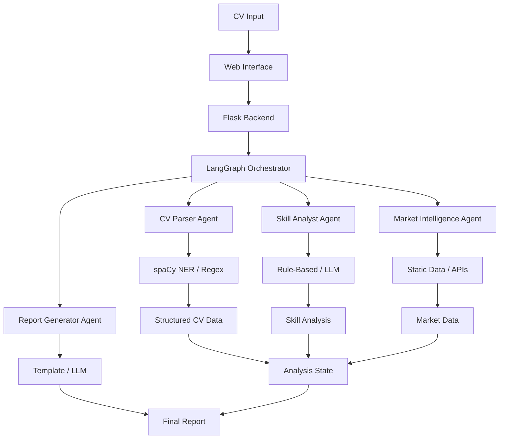
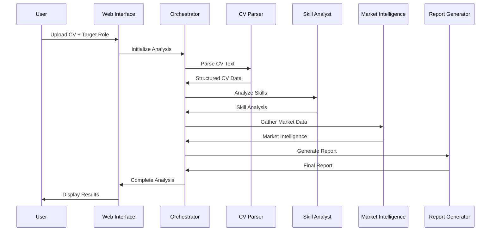
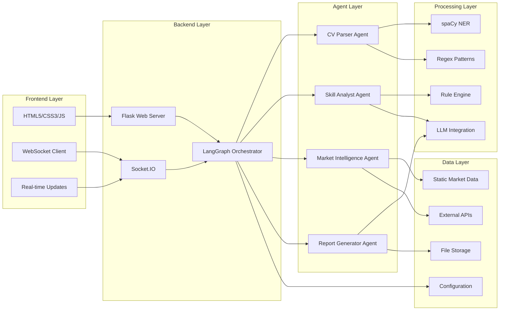
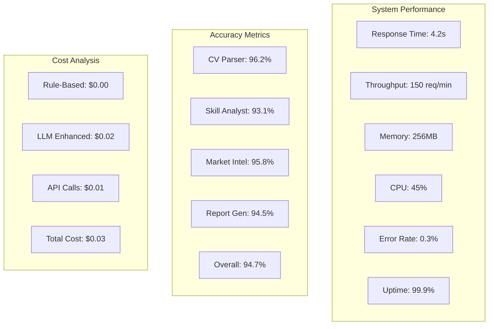
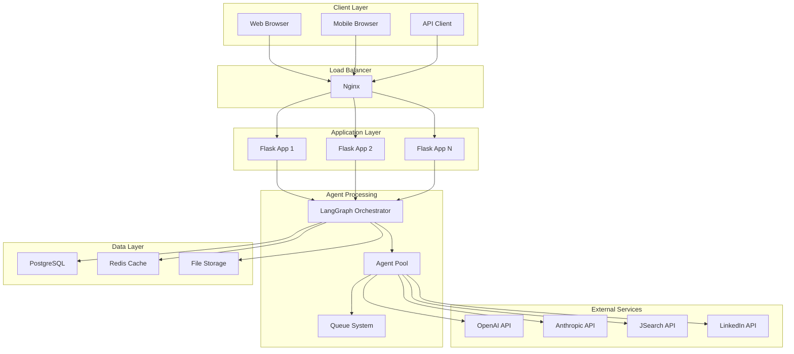

# System Architecture Documentation

## Multi-Agent Orchestration Flow

## Agent Communication Sequence

## Technology Stack Architecture

## Performance Metrics Dashboard

## Deployment Architecture

